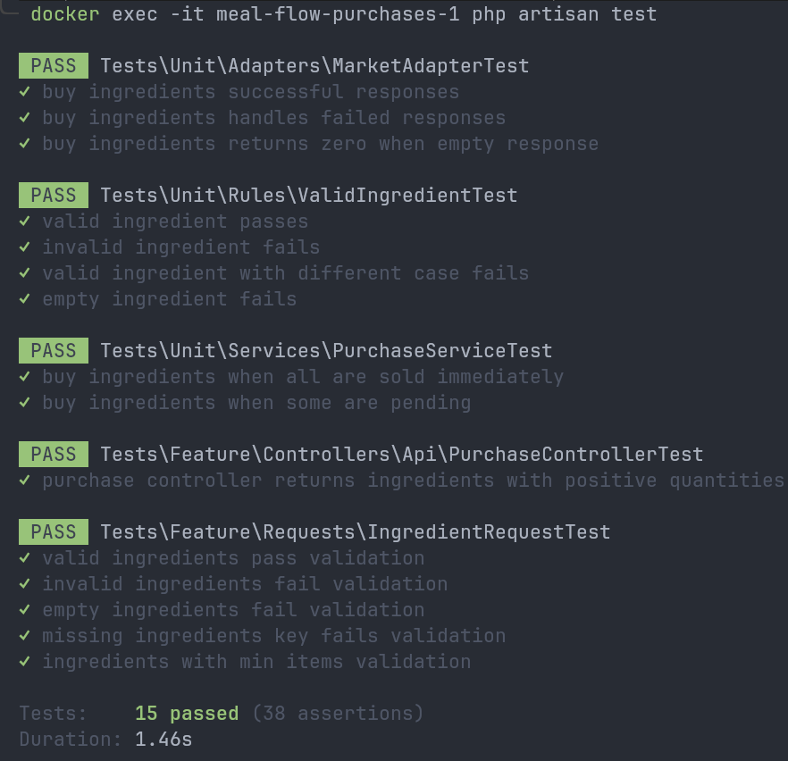

### README: **Proof Meal Flow**

#### **Descripción**
Proof Meal Flow es un proyecto que organiza y gestiona un flujo de microservicios orquestados mediante Docker Compose. Incluye servicios como bases de datos, sistemas de colas, y microservicios desarrollados en Laravel para funcionalidades específicas como notificaciones, inventarios y gestión de pedidos.

---

### **Estructura del Proyecto**

```bash
.
├── docker-compose.yml      # Archivo principal de orquestación con Docker Compose.
├── init-db.sh              # Script para inicializar la base de datos MySQL.
├── kitchen                 # Microservicio principal para gestionar órdenes.
├── Makefile                # Archivo Makefile para la automatización de tareas.
├── notifications           # Microservicio para el manejo de notificaciones.
├── purchases               # Microservicio para la gestión de compras.
└── warehouse               # Microservicio para la gestión de inventarios.
```

---

### **Requisitos Previos**
1. Tener instalado:
   - **Docker**
   - **Docker Compose**
   - **Make**
2. Clonar el repositorio:
   ```bash
   git clone git@github.com:josefo727/proof-meal-flow.git
   cd proof-meal-flow
   ```

3. Configurar variables de entorno:
   - Copiar el archivo `.env.example` en la raíz a `.env`:
     ```bash
     cp .env.example .env
     ```
   - Realizar el mismo proceso dentro de cada microservicio:
     ```bash
     cp kitchen/.env.example kitchen/.env
     cp warehouse/.env.example warehouse/.env
     cp purchases/.env.example purchases/.env
     cp notifications/.env.example notifications/.env
     ```

---

### **Comandos Principales**

#### **Levantar el Proyecto**
1. **Construir imágenes desde cero:**
   ```bash
   make build
   ```
2. **Levantar los contenedores y preparar dependencias:**
   ```bash
   make up action=install-deps
   ```
   Esto inicializa los microservicios, instala dependencias y configura el entorno.

#### **Restablecer Todo**
Para reiniciar el proyecto eliminando datos persistentes:
```bash
make clean
make build
make up action=install-deps
```

#### **Verificar Contenedores Activos**
```bash
make ps
```

#### **Ver Logs en Tiempo Real**
```bash
make logs
```

#### **Apagar el Proyecto**
```bash
make down
```

---

### **Detalles Técnicos**

#### **Makefile**
El `Makefile` automatiza tareas comunes. Los comandos más importantes incluyen:

- **`up`**: Levanta los contenedores en segundo plano y espera a que los servicios estén listos.
- **`install-deps`**: Instala dependencias de PHP y Node.js en cada microservicio.
- **`clean`**: Elimina datos persistentes como volúmenes y bases de datos.
- **`build`**: Construye las imágenes de Docker desde cero.
- **`logs`**: Muestra los logs de los contenedores en tiempo real.

#### **`docker-compose.yml`**
Este archivo define los servicios Docker que conforman el proyecto:
- **MySQL**: Base de datos principal.
- **RabbitMQ**: Sistema de colas para manejar eventos.
- **Redis**: Sistema de almacenamiento en memoria.
- Microservicios:
  - `kitchen`: Gestión de órdenes.
  - `warehouse`: Inventarios.
  - `purchases`: Compras.
  - `notifications`: Notificaciones en tiempo real.

---

### **Notas Importantes**
1. Asegúrate de que **Docker** esté ejecutándose antes de utilizar los comandos `make`.
2. Para resolver problemas de permisos o directorios inexistentes, verifica que las carpetas como `storage/logs` y `bootstrap/cache` estén creadas y sean escribibles.
   ```bash
   mkdir -p storage/logs bootstrap/cache
   chmod -R 775 storage bootstrap/cache
   ```

---

## **Arquitectura técnica y explicación**

El sistema está compuesto por una arquitectura basada en **microservicios** diseñada con **Laravel**, coordinada mediante **Docker** y soportada por **Redis**, **MySQL** y **RabbitMQ**, cumpliendo con todos los requisitos especificados en el reto técnico. A continuación, se detalla cómo cada uno de los microservicios y componentes cumple con los objetivos planteados:

---

### **Microservicios**
1. **Kitchen (Cocina)**
   - **Responsabilidad:** Gestionar los pedidos de platos y la preparación de las recetas.
   - **Flujo:**
     - Recibe solicitudes desde la interfaz para generar un nuevo pedido.
     - Selecciona aleatoriamente una receta de entre las 6 disponibles.
     - Solicita los ingredientes necesarios a la bodega mediante **RabbitMQ**.
     - Prepara y actualiza el estado de los pedidos.
   - **Persistencia:** Almacena los pedidos realizados y su historial en **MySQL**.

2. **Warehouse (Bodega de alimentos)**
   - **Responsabilidad:** Manejar el inventario de ingredientes y reabastecerlos.
   - **Flujo:**
     - Responde a las solicitudes de ingredientes provenientes de la cocina.
     - Si un ingrediente no está disponible, realiza compras en la **plaza de mercado** mediante la API externa.
     - Gestiona y actualiza el inventario en tiempo real.
   - **Persistencia:** Almacena el inventario actual y el historial de compras realizadas en **MySQL**.

3. **Purchases (Compras)**
   - **Responsabilidad:** Centralizar la comunicación con la API externa de la **plaza de mercado**.
   - **Flujo:**
     - Realiza peticiones a la API externa (`https://recruitment.alegra.com/api/farmers-market/buy`).
     - Proporciona los ingredientes adquiridos a la bodega mediante **RabbitMQ**.
   - **Persistencia:** Almacena un registro de todas las transacciones realizadas.

4. **Notifications**
   - **Responsabilidad:** Gestionar notificaciones en tiempo real.
   - **Flujo:**
     - Emite eventos sobre actualizaciones de pedidos o inventarios mediante **Laravel Echo** y **Reverb**.
     - Permite que los clientes y administradores visualicen actualizaciones en la interfaz en tiempo real.

---

### **Componentes base**

1. **RabbitMQ:**
   - **Función:** Actúa como intermediario de mensajería para garantizar la comunicación asíncrona entre los microservicios.
   - **Uso:**
     - La cocina envía solicitudes de ingredientes a la bodega.
     - La bodega comunica a la cocina la disponibilidad de ingredientes.
     - La plaza de mercado informa sobre las compras realizadas.

2. **Redis:**
   - **Función:** Cachea los datos de inventarios y estados de pedidos para optimizar las consultas frecuentes.
   - **Uso:**
     - Evita realizar consultas recurrentes a la base de datos.
     - Mejora la latencia en la actualización de datos en tiempo real.

3. **MySQL:**
   - **Función:** Base de datos relacional para almacenar información persistente.
   - **Uso:**
     - Manejo de recetas, pedidos, inventarios e historial de compras.

---

### **Cumplimiento de los requisitos**

1. **Pedidos masivos:**
   - RabbitMQ maneja colas para gestionar múltiples solicitudes de pedidos simultáneamente.
   - Redis permite actualizar las vistas en tiempo real con bajo impacto en el rendimiento.

2. **Inventario y recetas:**
   - La bodega gestiona eficientemente el stock de los ingredientes.
   - La cocina selecciona recetas aleatorias basadas en los ingredientes disponibles.

3. **Historial y notificaciones:**
   - Cada transacción (pedidos, inventarios y compras) se registra en MySQL.
   - Laravel Echo/Reverb permite emitir notificaciones en tiempo real para actualizar la vista.

4. **Escalabilidad:**
   - La arquitectura basada en microservicios facilita la escalabilidad horizontal y la distribución independiente de cada módulo.

---

### **Implementación de TDD en el Microservicio "Purchases"**

Debido a las restricciones de tiempo, opté por aplicar **Desarrollo Guiado por Pruebas (TDD)** únicamente en el microservicio **Purchases** para demostrar el dominio de esta metodología de desarrollo.

---

### **Metodología aplicada**

1. **Diseño de pruebas antes del desarrollo:**
   - Se identificaron los casos de uso clave del microservicio:
     - Comunicación con la API externa (`https://recruitment.alegra.com/api/farmers-market/buy`).
     - Validación de datos retornados por la API.
     - Gestión y almacenamiento de las transacciones realizadas.

2. **Ciclo de TDD:**
   - **Red:** Escribimos pruebas que inicialmente fallan.
   - **Green:** Desarrollamos el código mínimo necesario para que las pruebas pasen.
   - **Refactor:** Optimizamos el código para garantizar su calidad, manteniendo las pruebas verdes.

---

### **Pruebas implementadas**

Las pruebas fueron ejecutadas dentro del contenedor de Docker correspondiente al microservicio `purchases`:

```bash
docker exec -it meal-flow-purchases-1 php artisan test
```

Al ejecutarlas, se confirmó que todas las pruebas definidas pasaron exitosamente:



---

### **Impacto de TDD**

El uso de TDD en este microservicio permitió:
1. **Confiabilidad del sistema:** Las funcionalidades críticas del microservicio están completamente validadas.
2. **Reducción de errores:** El diseño basado en pruebas asegura que el código sea robusto y cumpla con los requisitos funcionales.
3. **Base para futuras implementaciones:** El enfoque puede extenderse a los otros microservicios para seguir garantizando calidad en el desarrollo.
